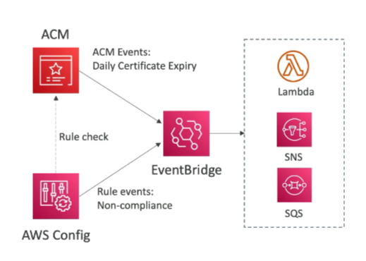

# ACM - Importing Public Certificates

## Overview

- **Import Certificates**: Option to generate the certificate outside of ACM and then import it.
- **No Automatic Renewal**: Must import a new certificate before expiry.

## Expiration Notifications

- **Daily Expiration Events**: ACM sends daily expiration events starting 45 days prior to expiration.
    - **Configurable Days**: The number of days can be configured.
    - **EventBridge**: Events appear in EventBridge.

## AWS Config

- **Managed Rule**: AWS Config has a managed rule named `acm-certificate-expiration-check` to check for expiring certificates.
    - **Configurable Days**: The number of days is configurable.

