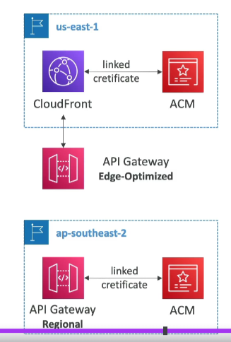

# ACM - Integration with API Gateway

## Custom Domain Name

- **Create a Custom Domain Name**: In API Gateway.

## Edge-Optimized (Default)

- **Global Clients**: For global clients.
- **Routing**: Requests are routed through the CloudFront Edge locations (improves latency).
- **Region**: The API Gateway still lives in only one region.
- **TLS Certificate**: Must be in the same region as CloudFront, in `us-east-1`.
- **DNS Setup**: Then set up a CNAME or (better) A-Alias record in Route 53.

## Regional

- **Same Region Clients**: For clients within the same region.
- **TLS Certificate**: Must be imported on API Gateway, in the same region as the API Stage.

