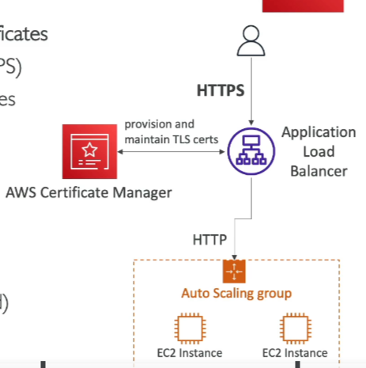

# AWS Certificate Manager (ACM)

## Overview

- **Provision and Manage**: Easily provision, manage, and deploy TLS Certificates.
- **In-Flight Encryption**: Provide in-flight encryption for websites (HTTPS).
- **Certificate Types**: Supports both public and private TLS certificates.
- **Cost**: Free of charge for public TLS certificates.
- **Renewal**: Automatic TLS certificate renewal.

## Integrations

- **Elastic Load Balancers**: Load TLS certificates on CLB, ALB, NLB.
- **CloudFront Distributions**
- **APIs on API Gateway**

## Limitations

- **EC2**: Cannot use ACM with EC2 (certificates can't be extracted).

