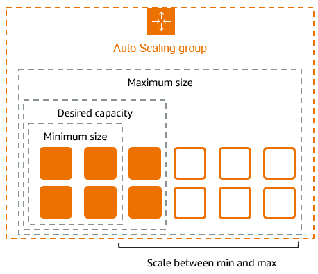

# Auto Scaling Group (ASG)

## Goal of ASG

- Scale out (add EC2 instances) to match an increased load.
- Scale in (remove EC2 instances) to match a decreased load.
- Ensure we have a minimum and a maximum number of EC2 instances running.
- Automatically register new instances to a load balancer.
- Re-create an EC2 instance in case a previous one is terminated (e.g., if unhealthy).
- ASGs are free. You only pay for the underlying EC2 instances.

## ASG Attributes

- AMI + Instance Type
- EC2 User Data
- EBS volumes
- Security Groups
- SSH key pair
- IAM roles for your EC2 Instances
- Network + Subnets Information
- Load balancer information
- Min size/ max size/ initial capacity
- Scaling policies

## CloudWatch Alarms & Scaling

- It is possible to scale an ASG based on CloudWatch alarms.
- An alarm monitors a metric (such as Average CPU, or a custom metric).
- Metrics such as Average CPU are computed for the overall ASG instances.
- Based on the alarm:
    - We can create scale-out policies (increase the number of instances).
    - We can create scale-in policies (decrease the number of instances).

