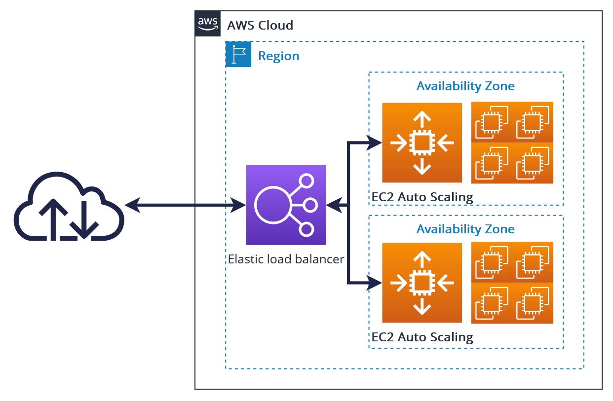

# Scalability & High Availability

- Scalability means that an application / system can handle greater loads by adapting.
- There are two kinds of scalability:
  - **Vertical Scalability** (scale up): Increase the size of the instance (more CPU, RAM)
  - **Horizontal Scalability** (scale out): Increase the number of instances/systems
- Scalability is linked but different to High Availability.

## Vertical Scalability
- Vertical scalability means increasing the size of the instance.
- For example, your application runs on a t2.micro
- Scaling that application vertically means running it on a t2.large
- Vertical scalability is very common for non-distributed systems, such as a database.
- RDS, ElastiCache are services that can scale vertically.
- There's usually a limit to how much you can vertically scale (hardware limit).

## Horizontal Scalability
- Horizontal scalability means increasing the number of instances/systems.
- For example, your application runs on one EC2 instance.
- Scaling that application horizontally means running it on multiple EC2 instances behind a load balancer.
- Horizontal scalability is very common for distributed systems.
- EC2, ECS, EKS, and Lambda are services that can scale horizontally.

## High Availability
- High availability usually goes hand in hand with horizontal scaling
- High availability means running your application in at least two data centers (availability zones).
- The goal of HA is to survive a data center loss.
- High availability can be passive (for RDS multi AZ for example)
- High availability can be active (for horizontal scaling)

