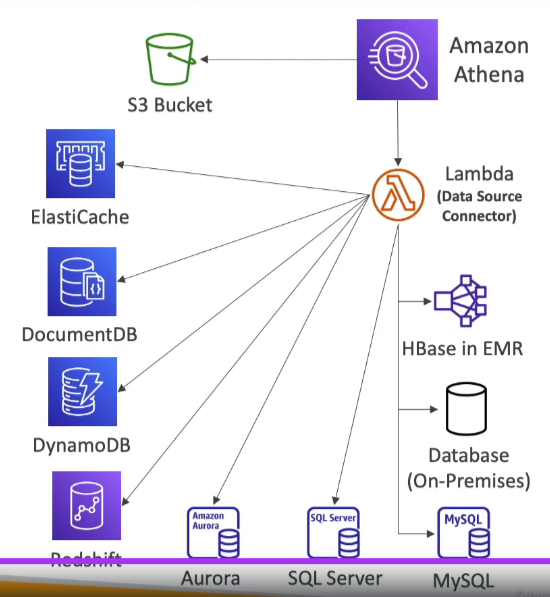

# Athena - Federated Query

## Overview
Athena Federated Query allows you to run SQL queries across data stored in relational, non-relational, object, and custom data sources, whether they are on AWS or on-premises.

## Key Features
- **Data Source Connectors**: Uses connectors that run on AWS Lambda to execute federated queries.
- **Supported Sources**: Includes CloudWatch Logs, DynamoDB, RDS, and more.
- **Result Storage**: Stores the query results back in Amazon S3.

## Benefits
- **Unified Querying**: Query multiple data sources with a single SQL query.
- **Serverless**: No infrastructure to manage, leveraging AWS Lambda for execution.
- **Scalable**: Automatically scales to handle large datasets and complex queries.

## Use Cases
- **Cross-Source Analytics**: Perform analytics across diverse data sources.
- **Data Integration**: Integrate data from various sources for comprehensive analysis.
- **Log Analysis**: Query and analyze logs from CloudWatch Logs, DynamoDB, etc.

