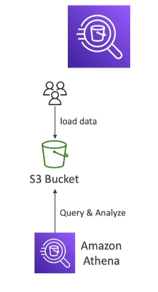

# Amazon Athena

## Overview
Amazon Athena is a serverless query service that allows you to analyze data stored in Amazon S3 using standard SQL. It is built on Presto and supports various data formats.

## Key Features
- **Serverless**: No infrastructure to manage.
- **SQL Support**: Uses standard SQL language.
- **Data Formats**: Supports CSV, JSON, ORC, Avro, and Parquet.
- **Integration**: Commonly used with Amazon QuickSight for reporting and dashboards.

## Pricing
- **Cost**: $5.00 per TB of data scanned.

## Use Cases
- **Business Intelligence/Analytics/Reporting**
- **Analyze & Query VPC Flow Logs**
- **Analyze ELB Logs**
- **Analyze CloudTrail Trails**

## Exam Tip
- **Athena**: Analyze data in S3 using serverless SQL.

