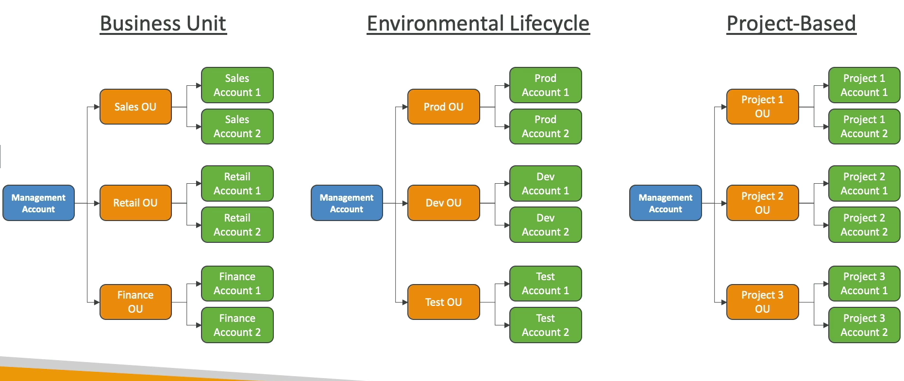
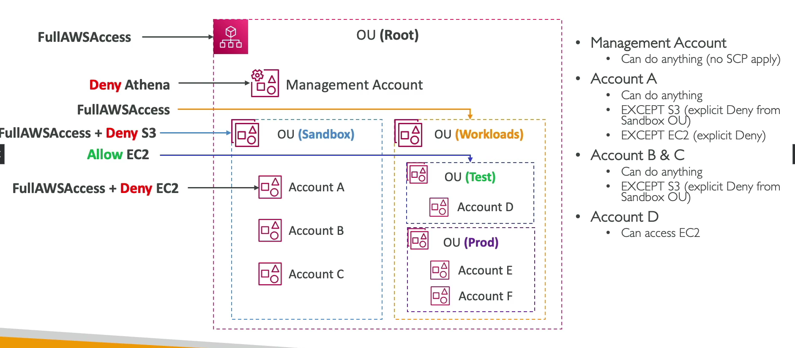

# AWS Organizations

## Overview

- **Global service**: Allows managing multiple AWS accounts.
- **Management account**: The main account.
- **Member accounts**: Other accounts that can only be part of one organization.
- **Consolidated Billing**: Single payment method across all accounts.
- **Pricing benefits**: Aggregated usage (volume discount for EC2, S3, etc.).
- **Shared discounts**: Reserved instance and Savings Plans discounts across accounts.

## Advantages

- **Multi-account vs one account**: Multi VPC.
- **Tagging standards**: For billing purposes.
- **CloudTrail**: Enabled on all accounts, send logs to central S3 accounts.
- **CloudWatch Logs**: Send to central logging account.
- **Cross Account Roles**: For admin purposes.

## Security: Service Control Policies (SCP)

- **IAM policies**: Applied to OU or Accounts to restrict Users and Roles.
- **Management account**: Policies do not apply (full admin power).
- **Explicit allow**: Must have an explicit allow from the root through each OU in the direct path to the target account (does not allow anything by default - like IAM).

