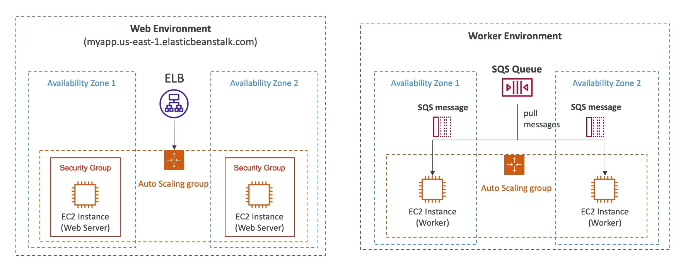

## Beanstalk Components Overview

### Application
- **Definition**: A collection of Elastic Beanstalk components including environments, versions, and configurations.
- **Purpose**: Serves as the organizational unit for your application's different iterations and operational settings.

### Application Version
- **Definition**: An iteration of your application code.
- **Purpose**: Allows for versioning of your application, enabling you to deploy different versions across various environments.

### Environment
- **Definition**: A collection of AWS resources running an application version. Only one application version can be active at a time within an environment.
- **Components**:
    - **Tiers**:
        - **Web Server Environment Tier**: Designed for serving HTTP/S requests.
        - **Worker Environment Tier**: Processes tasks in the background, independent of user requests.
    - **Purpose**: Supports the deployment and management of application versions in a scalable and managed AWS infrastructure.
- **Multiple Environments**: Enables the creation of separate environments for development, testing, production, etc., facilitating a structured deployment pipeline.

