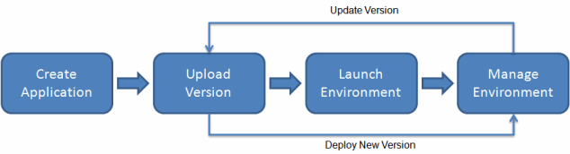

## Elastic Beanstalk Overview

Elastic Beanstalk provides a developer-centric approach to deploying applications on AWS, leveraging a range of AWS components such as EC2, Auto Scaling Groups (ASG), Elastic Load Balancer (ELB), and Relational Database Service (RDS). It simplifies the deployment and management of applications by automating tasks like capacity provisioning, load balancing, scaling, and health monitoring.

### Key Features

- **Managed Service**: Elastic Beanstalk automates the management of your application's infrastructure, allowing developers to focus on writing code.
- **Uses AWS Components**: Integrates with AWS services like EC2 for computing, ASG for scaling, ELB for load balancing, and RDS for databases.
- **Developer Responsibility**: Developers are only responsible for their application code; Elastic Beanstalk handles the rest.
- **Configuration Control**: Provides full control over the AWS resources for your application, allowing for custom configurations.
- **Cost**: There is no additional charge for Elastic Beanstalk; you only pay for the AWS resources used to store and run your applications.

### Benefits

- **Simplified Deployment**: Deploy applications without worrying about the underlying infrastructure.
- **Automatic Scaling**: Automatically scales your application up or down based on defined policies.
- **Health Monitoring**: Offers application health monitoring and alerting capabilities.
- **Easy Updates**: Simplifies the process of updating applications with minimal downtime.

### Considerations

- **Underlying Costs**: While Elastic Beanstalk itself is free, the AWS resources it provisions (like EC2 instances and RDS databases) incur charges.
- **Configuration Learning Curve**: Understanding and optimizing the configuration for specific needs may require some learning.

Elastic Beanstalk is ideal for developers seeking an efficient and scalable way to deploy applications on AWS without the overhead of managing the infrastructure.

