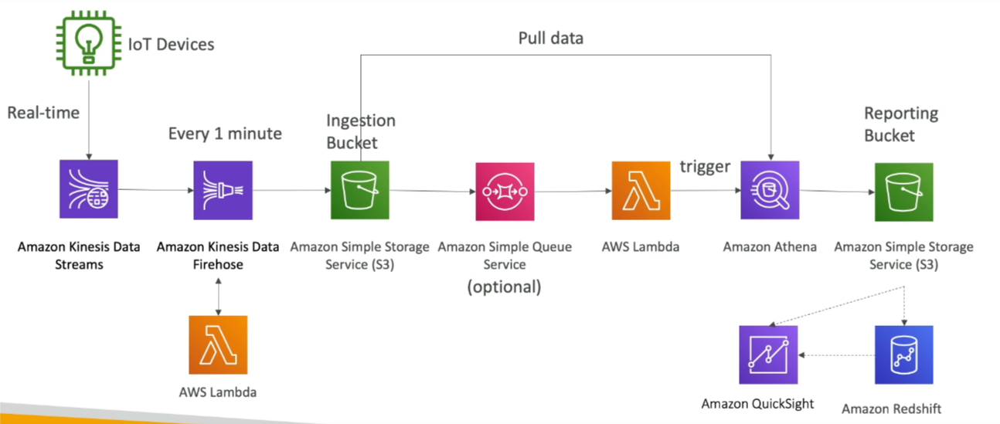

# Big Data Ingestion Pipeline

A fully serverless big data ingestion pipeline that collects data in real-time, transforms it, and allows querying using SQL. The reports created from these queries are stored in S3, and the data is loaded into a data warehouse for dashboard creation.

## Requirements

- **Serverless**: The entire pipeline should be fully managed without the need to manage infrastructure.
- **Real-time Data Collection**: Collect data in real-time.
- **Data Transformation**: Transform the collected data.
- **SQL Querying**: Query the transformed data using SQL.
- **Report Storage**: Store the generated reports in S3.
- **Data Warehouse Loading**: Load the data into a data warehouse for dashboard creation.

## Components

- **IoT Core**: Harvest data from IoT devices.
- **Kinesis**: Great for real-time data collection.
- **Firehose**: Helps with data delivery to S3 in near real-time (1 minute).
- **Lambda**: Can help Firehose with data transformations.
- **S3**: Can trigger notifications to SQS.
- **SQS**: Queue service that can trigger Lambda functions.
- **Athena**: Serverless SQL service with results stored in S3.
- **Reporting Tools**: The reporting bucket contains analyzed data and can be used by tools such as AWS QuickSight, Redshift, etc.

## Pipeline Steps

1. **Data Collection**:
    - Use IoT Core to harvest data from IoT devices.
    - Stream the data to Kinesis for real-time collection.

2. **Data Delivery**:
    - Use Firehose to deliver data to S3 in near real-time (1 minute).
    - Use Lambda to transform data within Firehose if needed.

3. **Data Storage and Notification**:
    - Store the transformed data in S3.
    - Configure S3 to trigger notifications to SQS.

4. **Data Processing**:
    - Use Lambda to subscribe to SQS and process the data further if required.

5. **Data Querying and Reporting**:
    - Use Athena to query the data stored in S3.
    - Store the query results in a reporting bucket in S3.
    - Use reporting tools like AWS QuickSight or Redshift to create dashboards and reports from the analyzed data.

## Architecture Diagram

1. **IoT Core**: Harvest data from IoT devices.
2. **Kinesis**: Real-time data collection.
3. **Firehose**: Data delivery to S3.
4. **Lambda**: Data transformation.
5. **S3**: Data storage and notification.
6. **SQS**: Trigger Lambda functions.
7. **Athena**: Query data.
8. **Reporting Tools**: Create dashboards and reports.

By leveraging these AWS services, you can build a fully serverless big data ingestion pipeline that meets all the specified requirements.

