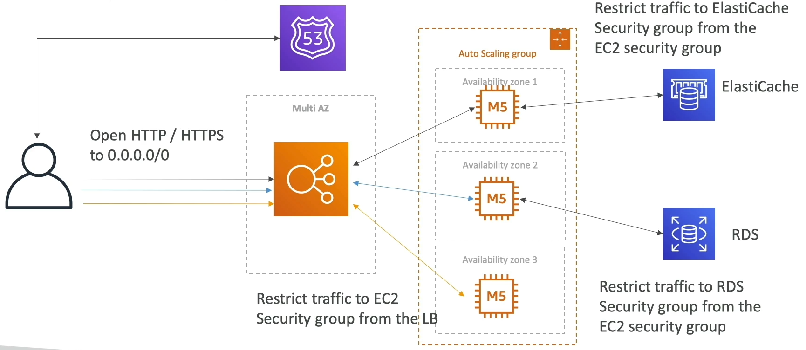

# 3-tier architectures for web applications

- ELB sticky sessions
- Web client for storing cookies and making our web app stateless
- ElastiCache
  - For storing sessions (alternative: DynamoDB)
  - For caching data from RDS
  - Multi AZ
- RDS
  - For storing user data
  - Read replicas for scaling reads
  - Multi AZ for disaster recovery
- Tight Security with security groups referencing each other

