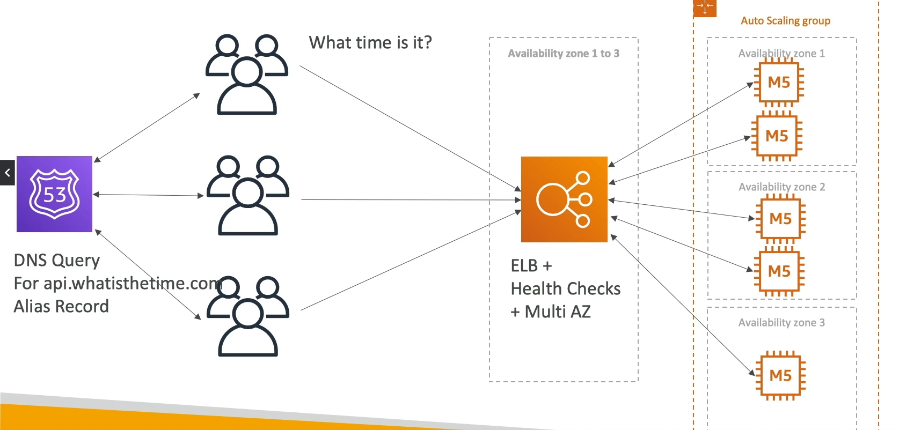

- Public vs Private IP and EC2 instances
- Elastic IP vs Route 53 vs Load Balancers
- Route 53 TTL, A records and Alias Records
- Maintaining EC2 instances manually vs Auto Scaling Groups
- Multi AZ to survive disasters
- ELB Health Checks
- Security Group Rules
- Reservation of capacity for costing savings when possible
- We're considering 5 pillars for a well architected application:
- costs, performance, reliability, security, operational excellence

