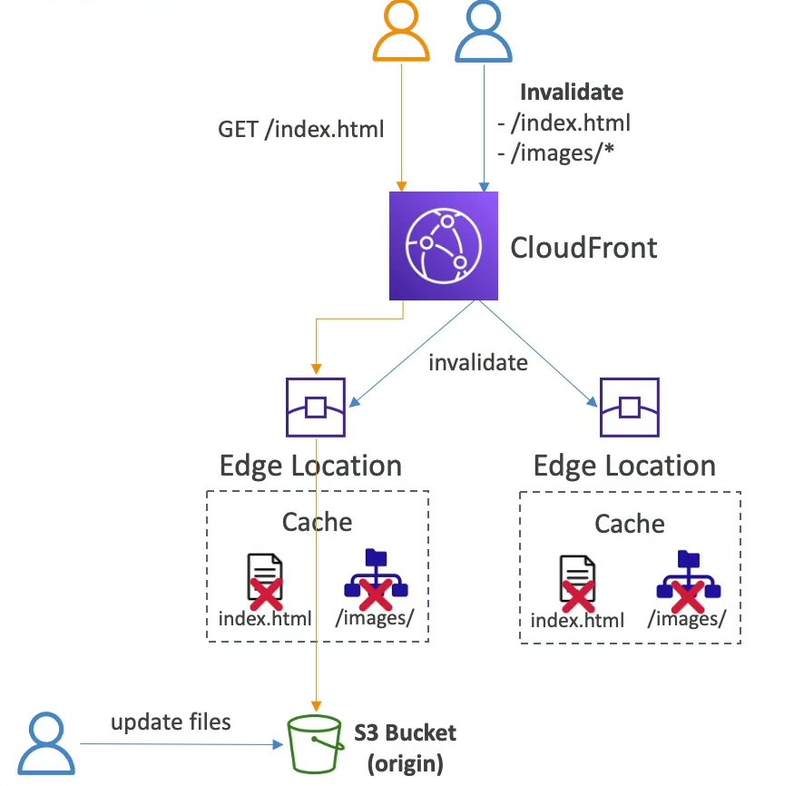

# Cache Invalidations

When updates are made to the back-end origin, CloudFront is not immediately aware of these changes. As a result, CloudFront continues to serve the cached content until the Time To Live (TTL) expires. To ensure that the most recent content is delivered before the TTL expires, CloudFront allows for cache invalidation.

## Performing a CloudFront Invalidation

Cache invalidation is a process that forces CloudFront to refresh its cached content, either entirely or partially, bypassing the TTL settings. This ensures that your users get the latest version of your content without waiting for the cache to expire.

### Invalidate All Files

- **Syntax**: `*`
- **Use Case**: When you need to refresh all the content across your distribution.

### Invalidate Specific Paths

- **Syntax**: `/path/to/content/*`
- **Use Case**: To target specific directories or file types, such as images or CSS files, without invalidating the entire cache.

By strategically using cache invalidations, you can manage how and when CloudFront updates its cached content, providing a balance between performance and content freshness.

