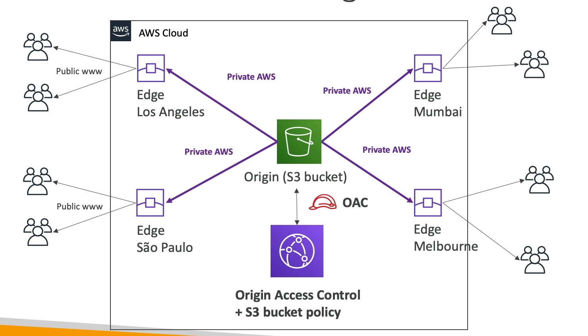

# CloudFront Origins

CloudFront distributions can fetch content from various types of origins, including Amazon S3 buckets and HTTP servers. This flexibility allows CloudFront to serve and cache content from the most appropriate source based on your application's architecture and needs.

## S3 Bucket as an Origin

- **File Distribution and Caching**: Utilize S3 buckets to store and distribute files, leveraging CloudFront's global edge network for caching, to reduce latency and improve load times for end-users.
- **Enhanced Security with CloudFront Origin Access Control (OAC)**: OAC, which is replacing Origin Access Identity (OAI), provides a secure way to restrict content delivery through CloudFront, ensuring that your S3 content can only be accessed via your CloudFront distribution.
- **CloudFront as an Ingress**: CloudFront can also be used as an ingress to upload files to S3, offering an efficient way to securely transfer files at scale.

## Custom Origin (HTTP)

- **Application Load Balancer**: Use an Application Load Balancer as an origin to distribute incoming application traffic across multiple targets, such as EC2 instances, in multiple Availability Zones.
- **EC2 Instance**: Directly use an EC2 instance as an origin for dynamic content that requires computation or database access.
- **S3 Website**: For static websites hosted on S3, enable the bucket for static website hosting to use it as a custom origin. This allows CloudFront to cache and distribute static web content efficiently.

