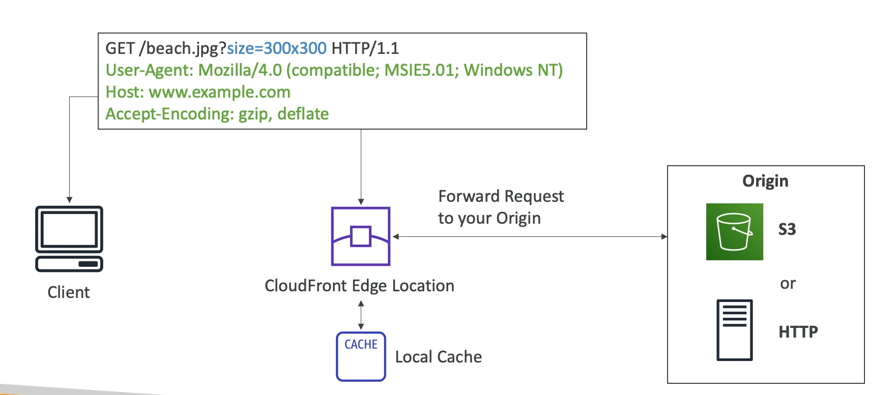

# Amazon CloudFront

Amazon CloudFront is a fast content delivery network (CDN) service that securely delivers data, videos, applications, and APIs to customers globally with low latency and high transfer speeds. CloudFront is integrated with AWS – both physically and via the network – to provide an easy way to distribute content to end users with no minimum usage commitments.

## Key Features

- **Global Reach**: With 216 Points of Presence (PoPs) globally, including edge locations, CloudFront ensures your content is available to users with minimal delay no matter where they are.
- **Improved Read Performance**: Content is cached at the edge locations closest to your users, which significantly improves read performance and user experience.
- **DDoS Protection**: CloudFront is integrated with AWS Shield and AWS Web Application Firewall (WAF), offering protection against DDoS attacks and helping to safeguard your applications from web exploits.

## Benefits

- **Enhanced User Experience**: By delivering content from the nearest edge location, CloudFront reduces latency, improving the overall user experience.
- **Security at the Edge**: With AWS Shield and AWS WAF integration, CloudFront provides robust security measures to protect against a wide range of attacks.
- **Scalability**: CloudFront is designed to handle spikes in traffic, ensuring that your content is delivered with consistent performance at any scale.

## Use Cases

- **Website and Web Application Acceleration**: Speed up the distribution of static and dynamic web content, such as .html, .css, .js, and image files.
- **API Acceleration**: Improve the performance and reliability of your APIs by caching API responses at the edge locations.
- **Content Caching**: Store copies of frequently accessed content at edge locations, reducing the load on your origin server and improving content delivery speeds.

By leveraging Amazon CloudFront, businesses can ensure their content is delivered quickly and securely to users around the world, enhancing the overall user experience and protecting against web threats.

