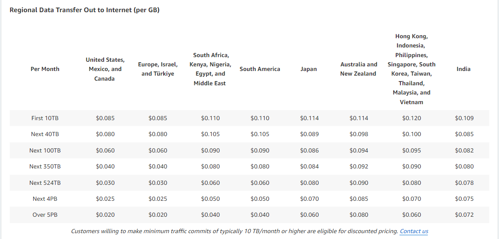

# Price Classes

Amazon CloudFront offers different price classes to help control costs by limiting the number of edge locations used to deliver content. Choosing the right price class allows you to balance between performance and cost.

## Price Class All

- **Regions Included**: All regions.
- **Performance**: Best performance, as it utilizes the full global network of edge locations.
- **Use Case**: Ideal for content that requires the highest availability and speed across the globe.

## Price Class 200

- **Regions Included**: Most regions, excluding the most expensive ones.
- **Performance**: Good performance with a cost-effective approach by avoiding the most costly regions.
- **Use Case**: Suitable for applications that need a broad reach but are sensitive to the cost of delivery in the most expensive regions.

## Price Class 100

- **Regions Included**: Only the least expensive regions.
- **Performance**: Basic performance, limited to the most cost-effective regions.
- **Use Case**: Best for content delivery where cost savings are prioritized over global reach and performance.

