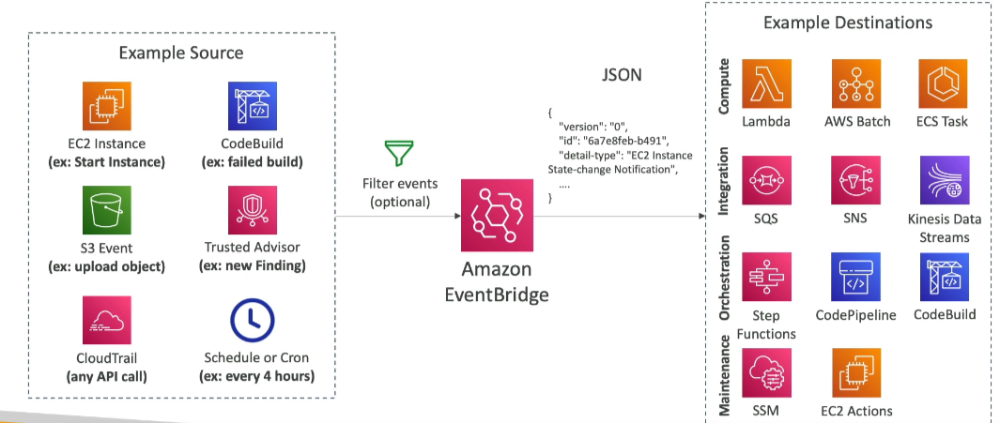
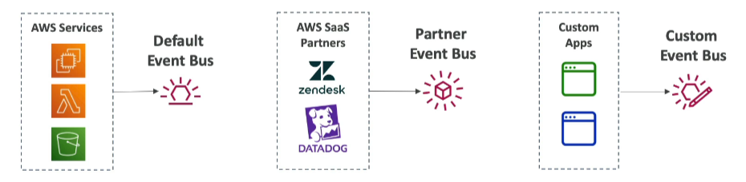

# EventBridge

Amazon EventBridge is a serverless event bus service that makes it easy to connect applications using data from your own applications, integrated Software-as-a-Service (SaaS) applications, and AWS services.

## Features

### Schedule

- **Cron Jobs**: Schedule events using cron expressions.
    - **Example**: Schedule every hour to trigger a script on a Lambda function.

### Event Pattern

- **Event Rules**: React to events from various services.
    - **Example**: IAM Root user sign-in event -> SNS topic with email notification.

### Event Targets

- **Trigger Lambda Functions**: Execute Lambda functions in response to events.
- **Send SQS/SNS Messages**: Send messages to SQS queues or SNS topics.

### Event Buses

- **Cross-Account Access**: Event buses can be accessed by other AWS accounts using resource-based policies.

### Event Archiving

- **Archive Events**: Archive all or filtered events sent to an event bus.
    - **Retention**: Indefinitely or for a set period.
- **Replay Events**: Ability to replay archived events.

By leveraging these features, you can build robust event-driven architectures with Amazon EventBridge.

