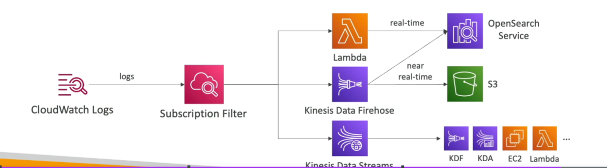

# CloudWatch Logs

Amazon CloudWatch Logs enables you to monitor, store, and access log files from various sources. Below is an overview of its key features and components.

## Components

- **Log Groups**: Arbitrary names, usually representing an application.
- **Log Streams**: Instances within an application, log files, or containers.

## Features

- **Log Expiration Policies**: Define log expiration policies ranging from never expire to 1 day to 10 years.
- **Log Destinations**: CloudWatch Logs can send logs to:
    - S3 Exports
    - Kinesis Data Streams
    - Kinesis Data Firehose
    - AWS Lambda
    - OpenSearch
- **Encryption**:
    - Logs are encrypted by default.
    - Can set up KMS-based encryption with your own keys.

