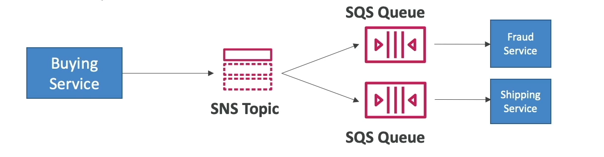

# SNS + SQS: Fan-Out Pattern

The fan-out pattern with Amazon Simple Notification Service (SNS) and Amazon Simple Queue Service (SQS) allows for efficient message distribution to multiple SQS queues. This pattern ensures that when a message is published to an SNS topic, it is automatically delivered to all SQS queues subscribed to that topic.

## Key Features

- **Decoupling**: SNS and SQS work together to fully decouple the message producer from consumers, ensuring that system components can scale independently.
- **No Data Loss**: The combination of SNS topics and SQS queues ensures that messages are not lost, even if the consumer services are temporarily unavailable.
- **Data Persistence**: SQS queues store messages until they are processed, supporting data persistence, delayed processing, and retries.
- **Dynamic Scalability**: New SQS subscribers can be added over time without impacting the existing infrastructure or requiring changes to the SNS topic configuration.
- **Access Policy**: Ensure your SQS queue's access policy permits the SNS topic to write messages to it, enabling secure communication between services.
- **Cross-Region Delivery**: SNS topics can deliver messages to SQS queues in different AWS regions, facilitating global applications and disaster recovery strategies.

## Implementation Steps

1. **Create an SNS Topic**: Set up an SNS topic as the central point for publishing messages.
2. **Create SQS Queues**: Set up SQS queues that will subscribe to the SNS topic. Each queue acts as a separate consumer that can process messages independently.
3. **Subscribe SQS Queues to SNS Topic**: Configure each SQS queue to subscribe to the SNS topic. This enables the fan-out pattern where a single message published to the SNS topic is received by all subscribed SQS queues.
4. **Configure SQS Queue Access Policies**: Modify the access policies of your SQS queues to allow the SNS topic to send messages to them.
5. **Publish Messages to SNS Topic**: Send messages to the SNS topic. These messages are automatically distributed to all subscribed SQS queues.
6. **Process Messages from SQS Queues**: Implement consumers that poll the SQS queues to process the messages.

This architecture allows for robust, scalable, and decoupled applications that can handle high volumes of messages efficiently.

