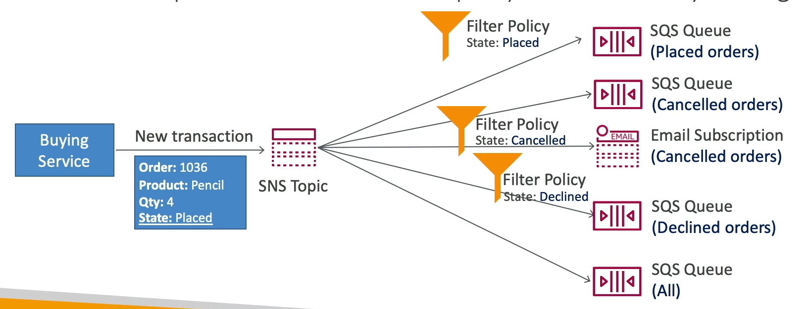

# Message Filtering in SNS Topics

Amazon Simple Notification Service (SNS) supports message filtering, allowing subscriptions to selectively receive messages based on the attributes of those messages. This feature enables subscribers to only process messages that are relevant to them, reducing unnecessary data transfer and processing.

## How It Works

- **JSON Filter Policy**: Subscriptions can specify a filter policy in JSON format. This policy defines attributes and values that messages must match to be delivered to the subscriber.
- **Message Attributes**: When publishing a message to an SNS topic, publishers can include a set of attributes. These attributes are key-value pairs that provide additional information about the message.
- **Filtering Process**: SNS evaluates the filter policy of each subscription against the attributes of each published message. If the message attributes match the filter policy, the message is delivered to the subscription.
- **Default Behavior**: If a subscription does not have a filter policy, it receives every message published to the topic, regardless of the message attributes.

## Example

Consider a scenario where an SNS topic is used to publish notifications about different types of events: `order_placed` and `order_shipped`. A subscriber might only be interested in `order_shipped` events. The subscriber can set a filter policy to only receive messages with an attribute `eventType` set to `order_shipped`.

### Filter Policy Example

```json
{
  "eventType": ["order_shipped"]
}
```

