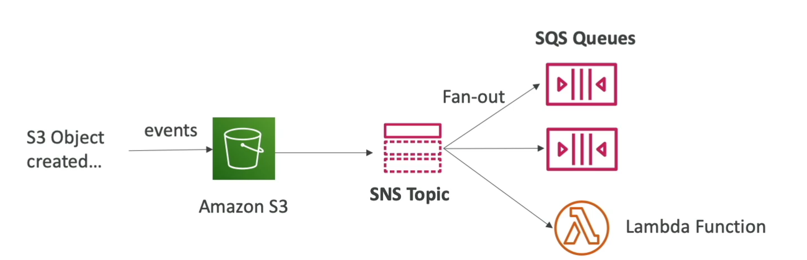

# S3 Events to Multiple SQS Queues via Fan-Out

To distribute a single type of S3 event (e.g., object creation under a specific prefix like `images/`) to multiple SQS queues, a fan-out pattern is recommended. Due to the limitation that only one S3 Event rule can be configured for a combination of event type and prefix, directly linking multiple SQS queues to the same S3 event is not feasible. Instead, the fan-out pattern can be implemented using SNS as an intermediary between S3 and multiple SQS queues.

## Implementation Overview

1. **Create an SNS Topic**: Set up an SNS topic to act as the central hub for distributing messages.
2. **Configure S3 Event Notification**: Set up an event notification on the S3 bucket to publish events (e.g., object creation events for files with the `images/` prefix) to the SNS topic.
3. **Create SQS Queues**: Create the SQS queues that will receive the S3 event notifications.
4. **Subscribe SQS Queues to the SNS Topic**: Configure each SQS queue to subscribe to the SNS topic. This enables the distribution of a single S3 event to multiple SQS queues.
5. **Set Up Permissions**: Ensure appropriate permissions are in place for S3 to publish to the SNS topic and for the SNS topic to send messages to the SQS queues.

## Benefits

- **Scalability**: Easily add more SQS queues as subscribers to the SNS topic without modifying the S3 bucket's event notification configuration.
- **Flexibility**: Different SQS queues can process the same S3 event for varied purposes, such as image processing, logging, or backup.
- **Simplicity**: Centralizes the management of event distribution, making the architecture easier to understand and maintain.

This approach leverages the strengths of AWS services to efficiently distribute events, ensuring that all interested components are notified of actions in S3 without direct coupling or complex configurations.

