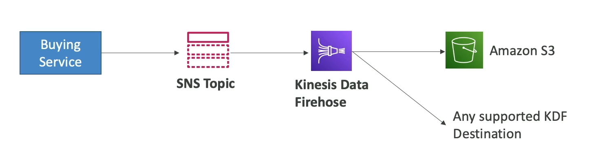

# SNS to Amazon S3 via Kinesis Data Firehose

To facilitate the direct integration of Amazon Simple Notification Service (SNS) with Amazon S3 through Kinesis Data Firehose, you can leverage the capabilities of AWS Lambda as an intermediary. This architecture enables the processing and storage of messages published to an SNS topic in an Amazon S3 bucket.

## Architecture Overview

1. **Publish to SNS Topic**: Messages are first published to an SNS topic. This step initiates the data flow process.
2. **Trigger AWS Lambda**: The SNS topic is configured to trigger an AWS Lambda function upon receiving a new message. This Lambda function acts as a bridge between SNS and Kinesis Data Firehose.
3. **Process with Lambda**: The Lambda function retrieves the message from SNS and processes it as needed. This processing can include transformations, filtering, or aggregation of data.
4. **Send to Kinesis Data Firehose**: After processing, the Lambda function forwards the message to a Kinesis Data Firehose delivery stream. This stream is configured to deliver data to an Amazon S3 bucket.
5. **Store in Amazon S3**: Kinesis Data Firehose buffers the incoming data and periodically writes it to the specified Amazon S3 bucket. This results in the durable storage of messages for downstream processing or analytics.

## Implementation Steps

1. **Create an SNS Topic**: Set up an SNS topic to collect and distribute messages.
2. **Set Up AWS Lambda Function**: Implement a Lambda function that is triggered by the SNS topic. This function should read the message payload and forward it to Kinesis Data Firehose.
3. **Configure Kinesis Data Firehose**: Create a Kinesis Data Firehose delivery stream with Amazon S3 as the destination. Specify the bucket and optional prefix under which the data should be stored.
4. **Lambda to Kinesis Data Firehose Integration**: In the Lambda function, add logic to send the processed message to the Kinesis Data Firehose delivery stream.
5. **Test the Integration**: Publish a test message to the SNS topic and verify that it flows through the system and is stored in the Amazon S3 bucket.

## Benefits

- **Scalability**: This architecture can handle high volumes of messages and scale automatically with AWS managed services.
- **Flexibility**: Processing steps can be customized in the Lambda function, allowing for complex data transformations before storage.
- **Durability**: Utilizing Amazon S3 for storage ensures high durability and availability of the data for further analysis or processing.

This solution architecture effectively bridges SNS with Amazon S3 through Kinesis Data Firehose, providing a scalable and flexible approach to data collection and storage.

