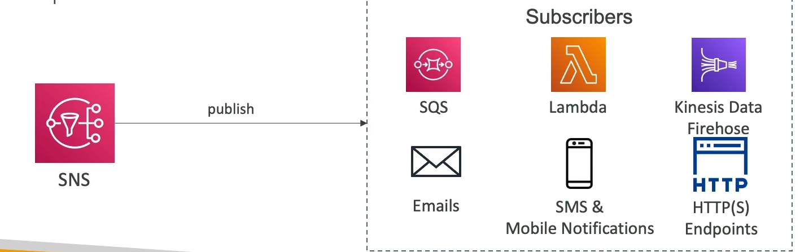

# SNS Overview

Amazon Simple Notification Service (SNS) is a fully managed messaging service for both application-to-application (A2A) and application-to-person (A2P) communication. The service enables you to decouple microservices, distributed systems, and serverless applications.

## Key Concepts

- **Event Producer**: The entity or application that publishes messages to a single SNS topic.
- **SNS Topic**: A logical access point and communication channel. Each message published to an SNS topic is delivered to all its subscribers.
- **Subscriptions**: Event receivers that are subscribed to the SNS topic. Subscribers can be web servers, email addresses, AWS Lambda functions, or several other AWS services.
- **Message Filtering**: A newer feature that allows subscribers to filter the messages they want to receive based on specific attributes, enabling more precise and relevant message handling.
- **Scalability**: SNS supports up to 12,500,000 subscriptions per topic, allowing a broad range of applications to listen for notifications.
- **Limits**: There is a limit of 100,000 topics per AWS account, which accommodates most use cases from small to large-scale applications.

## Benefits

- **Decoupling**: By using SNS, you can decouple your microservices, distributed systems, and serverless applications, improving scalability and reliability.
- **Flexibility**: With support for a wide variety of subscribers, SNS is flexible enough to meet the needs of almost any application architecture.
- **Durability and Reliability**: SNS is designed for durability and high availability, ensuring that messages are delivered reliably to subscribers.

