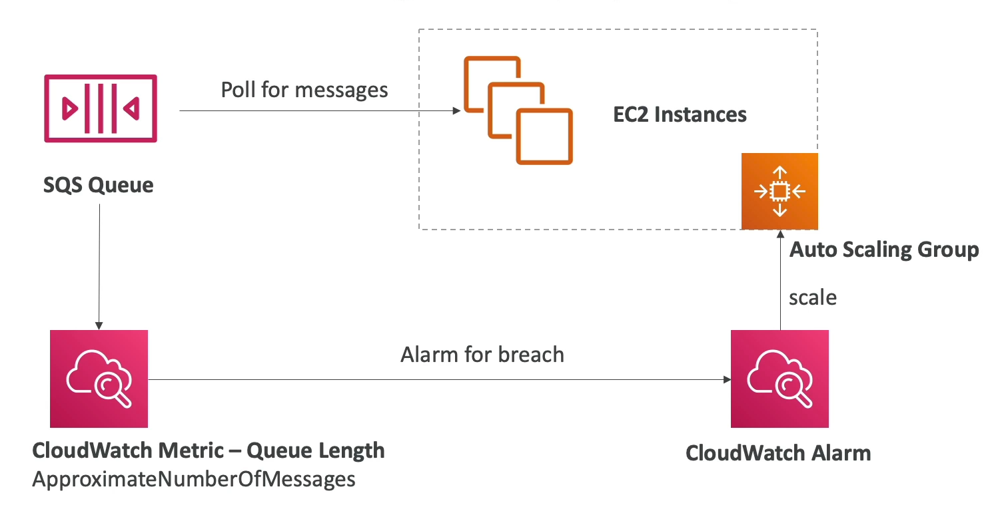
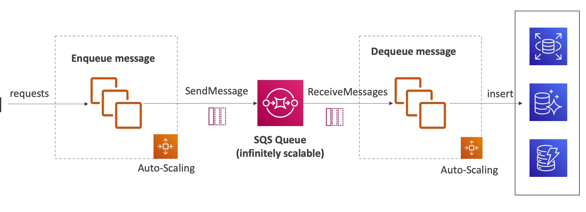
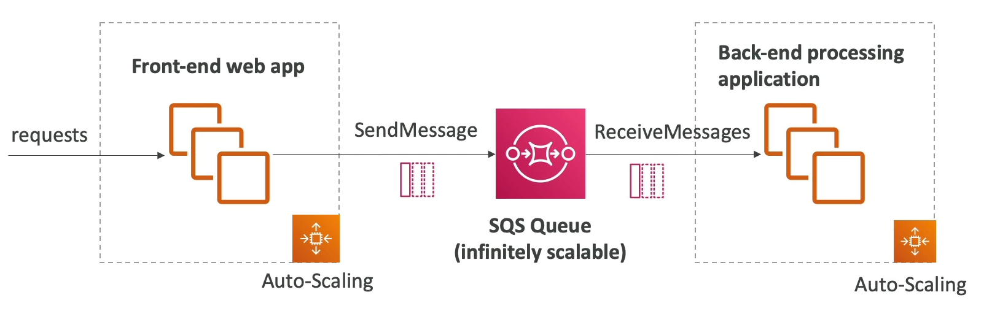

# Integrating SQS with Auto Scaling Groups

Integrating Amazon SQS (Simple Queue Service) with Auto Scaling Groups (ASGs) allows for dynamic scaling of EC2 instances based on the volume of messages in an SQS queue. This approach is particularly useful for applications that need to process messages or tasks that vary in volume over time.

## Overview

- **Purpose**: Dynamically scale EC2 instances in an Auto Scaling Group based on the number of messages in an SQS queue.
- **Benefits**: Ensures that your application can handle increases in workload without manual intervention and maintains optimal performance levels.

## How It Works

1. **Message Queue Monitoring**: Monitor the number of messages in the SQS queue. This can be the number of visible messages, messages in flight, or a combination of both.
2. **Scaling Policies**: Define scaling policies in the Auto Scaling Group based on the metrics obtained from the SQS queue.
3. **CloudWatch Alarms**: Use Amazon CloudWatch to create alarms that trigger the scaling policies based on predefined thresholds.
4. **Scaling Actions**: The Auto Scaling Group adjusts the number of EC2 instances based on the scaling policies, adding instances when the workload increases and removing them when the workload decreases.

## Considerations

- **Cooldown Periods**: Implement cooldown periods in your scaling policies to prevent rapid scaling actions that could lead to instability.
- **Message Processing Time**: Consider the average message processing time when configuring scaling policies to ensure that instances have enough time to process messages before being terminated.
- **Cost Management**: Monitor your costs closely, as dynamically adding instances can increase your AWS bill.

