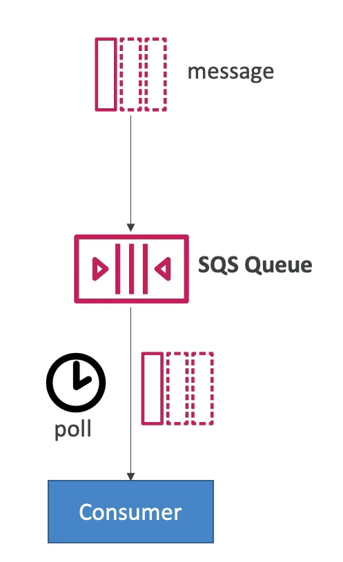

# Long Polling in SQS

Long polling is a feature in Amazon SQS that allows consumers to wait for messages to arrive in the queue before returning a response. This method is more efficient than short polling, as it reduces the number of API calls made to SQS, thereby improving the efficiency and latency of applications.

## Key Points

- **Efficiency**: Long polling decreases the number of unnecessary API calls to check for new messages, making it more efficient than short polling.
- **Latency**: By waiting for messages to arrive, long polling can improve the overall latency of message delivery in your applications.
- **Wait Time**: The wait time for long polling can be set between 1 second and 20 seconds, with 20 seconds being the recommended setting for most use cases.
- **Preference**: Long polling is generally preferred over short polling due to its efficiency and cost-effectiveness.
- **Configuration**: Long polling can be enabled at two levels: the **queue level** or at the API level using **WaitTimeSeconds**

