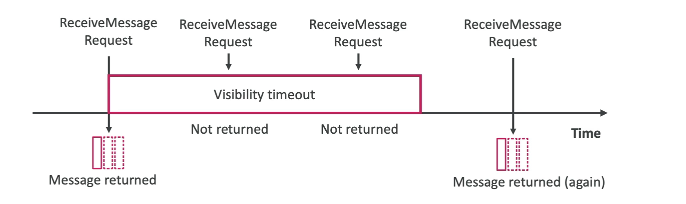

# Managing Message Visibility Timeout in SQS

The Message Visibility Timeout in Amazon SQS is a crucial setting that controls the period a message remains invisible to other consumers after being polled. This feature ensures that once a consumer starts processing a message, other consumers cannot process the same message simultaneously, preventing duplicate processing.

## Key Concepts

- **Default Timeout**: By default, the message visibility timeout is set to 30 seconds. This period starts the moment a message is received by a consumer.
- **Invisibility Period**: During the visibility timeout, the message is invisible to other consumers. It is expected that the consumer will process and delete the message within this timeframe.
- **Visibility Timeout Expiry**: If the message is not processed within the visibility timeout, it becomes visible again in the queue, making it available for reprocessing by the same or different consumers.
- **Duplicate Processing**: If a message is not processed within the visibility timeout, there's a risk of the message being processed more than once, leading to duplicates.

