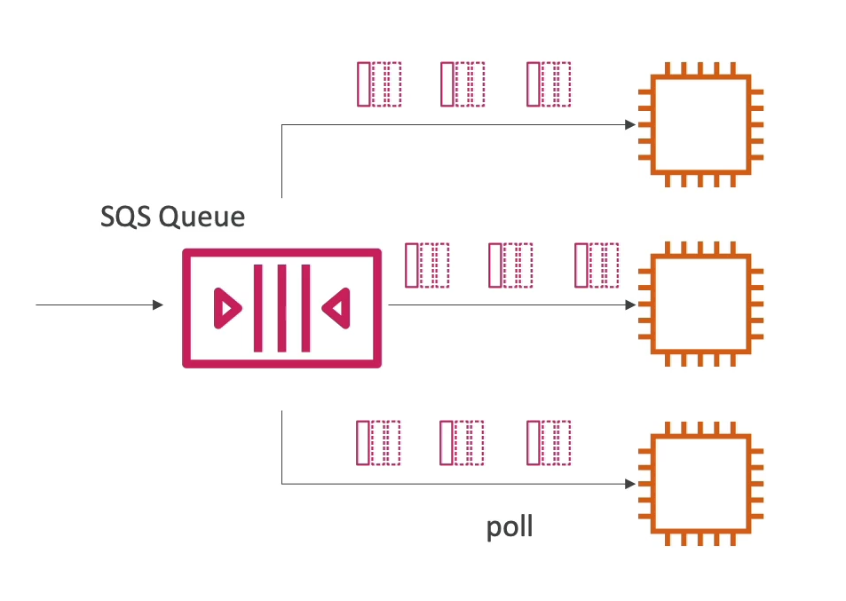

# Scaling SQS Message Consumption with Multiple EC2 Instances

To efficiently process messages from an Amazon SQS queue, deploying multiple EC2 instances as consumers allows for parallel processing, enhancing throughput and ensuring at least once delivery. This approach leverages the scalability and reliability of AWS services.

## Architecture Overview

- **Multiple Consumers**: Utilize several EC2 instances to consume messages from the SQS queue. Each instance acts independently, pulling messages and processing them in parallel.
- **At Least Once Delivery**: SQS ensures that each message is delivered at least once. However, due to the nature of distributed systems, ensure your processing logic is idempotent to handle potential duplicate messages.
- **Best-Effort Ordering**: While SQS standard queues do not guarantee strict order, the system is designed to deliver messages in a best-effort sequence. For applications requiring strict ordering, consider using SQS FIFO queues.
- **Message Deletion**: After successful processing, consumers must explicitly delete messages from the queue to prevent reprocessing, using the `DeleteMessage` API.

## Scaling Strategy

- **Horizontal Scaling**: Increase or decrease the number of EC2 instances based on the processing load. This can be automated using AWS Auto Scaling Groups to adjust the number of instances dynamically, ensuring high availability and cost efficiency.
- **Load Balancing**: Although SQS itself acts as a load balancer by distributing messages among consumers, ensure your application logic on EC2 instances can handle varying loads.
- **Monitoring and Alarms**: Implement CloudWatch metrics and alarms to monitor the queue depth, message processing times, and other relevant metrics. This allows you to scale proactively based on real-time data.

