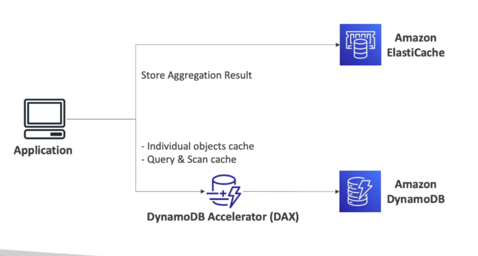

# DynamoDB Accelerator (DAX)

DynamoDB Accelerator (DAX) is a fully-managed, highly available, in-memory cache for DynamoDB that provides seamless caching capabilities. It is designed to alleviate read congestion and significantly reduce the latency to microseconds for cached data. Importantly, DAX is compatible with existing DynamoDB APIs, meaning it doesn't require any modifications to application logic to integrate and use its caching benefits.

## Key Features

- **Fully-Managed and Highly Available**: DAX is a managed service, which means all the maintenance, patching, and infrastructure management are handled by AWS. It is designed for high availability across multiple Availability Zones.

- **Seamless Integration**: Integrates directly with DynamoDB, using the same APIs, making it easy to add to existing applications without any code changes.

- **Microsecond Latency**: Provides microsecond response times for cached reads, significantly improving the performance of read-intensive applications.

- **Solves Read Congestion**: By caching frequently accessed data, DAX helps to alleviate read congestion, allowing applications to scale more effectively.

- **Compatibility**: Works with existing DynamoDB tables and applications without requiring any changes to application logic.

## Use Cases

- **High-Performance Applications**: Ideal for applications requiring extremely low latency access to data, such as gaming leaderboards, real-time analytics, and other latency-sensitive workloads.

- **Read-Heavy Workloads**: Significantly improves the performance of read-heavy workloads by caching the most frequently accessed data.

- **Scaling Applications**: Helps applications to scale by reducing the load on DynamoDB tables and mitigating read congestion.

## Getting Started

To start using DAX with your DynamoDB tables, you need to:

1. **Create a DAX Cluster**: Set up a DAX cluster in the AWS Management Console.
2. **Configure Your Application**: Update your application to use the DAX client instead of the standard DynamoDB client.
3. **Enjoy Improved Performance**: Begin accessing your DynamoDB data with significantly reduced latency.

DAX seamlessly integrates with DynamoDB, providing a powerful caching mechanism that enhances the performance and scalability of applications without requiring complex changes to existing application logic.

