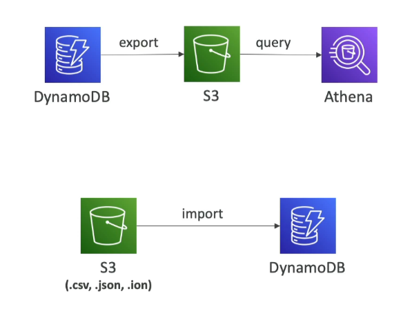

# DynamoDB - Integration with S3

DynamoDB's integration with Amazon S3 allows for efficient data export and import, facilitating data analysis, auditing, and ETL processes. This feature leverages Point-in-Time Recovery (PITR) for exports, ensuring minimal impact on your DynamoDB table's performance.

## Export to S3

Exporting data from DynamoDB to S3 is a seamless process that does not affect the read capacity of your table. It enables data analysis, retention of snapshots for auditing, and ETL processes on S3 data before re-importing it into DynamoDB.

### Key Features

- **PITR Required**: Must enable Point-in-Time Recovery (PITR) to use this feature.
- **Time Range**: Export data for any point in time within the last 35 days.
- **Performance**: Export process does not impact the read capacity of your DynamoDB table.
- **Data Analysis and Auditing**: Facilitates data analysis and retains snapshots for auditing purposes.
- **ETL Processes**: Perform ETL on S3 data before importing it back into DynamoDB.
- **Export Formats**: Supports export in DynamoDB JSON or ION format.

## Import from S3

Importing data into DynamoDB from S3 allows for flexibility in data migration and integration, supporting various formats without consuming write capacity.

### Key Features

- **Supported Formats**: Import data in CSV, DynamoDB JSON, or ION format.
- **Write Capacity**: Importing data does not consume any write capacity.
- **New Table Creation**: Imports create a new table in DynamoDB.
- **Error Logging**: Import errors are logged in CloudWatch Logs for troubleshooting.

## Getting Started

1. **Enable PITR**: Ensure that Point-in-Time Recovery is enabled for your DynamoDB table to utilize the export feature.
2. **Export Data to S3**: Initiate the export process from the DynamoDB Management Console or using the AWS CLI, specifying the desired time range and format.
3. **Perform ETL (Optional)**: Use AWS Glue or other ETL tools to process the exported data in S3 as needed.
4. **Import Data from S3**: Import data into DynamoDB by specifying the S3 source location and the data format. Monitor the import process and check CloudWatch Logs for any errors.

By integrating DynamoDB with S3, you can enhance your data management capabilities, enabling efficient data migration, analysis, and compliance with auditing requirements.

