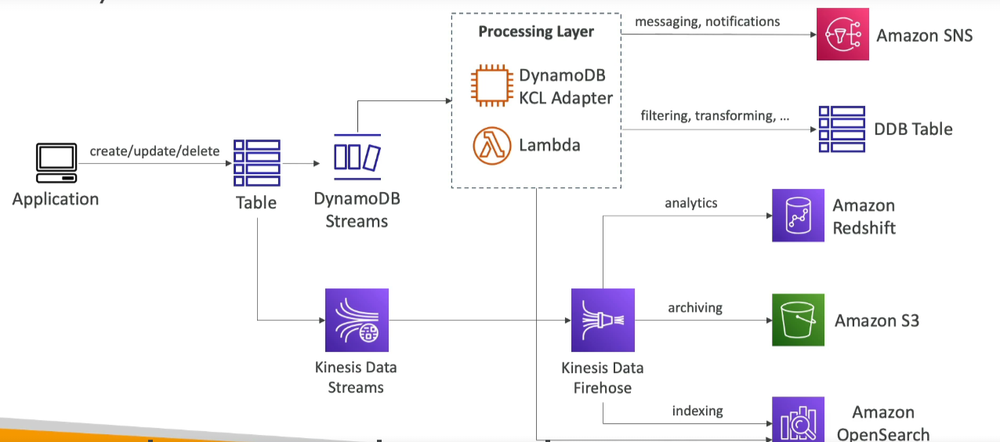

# DynamoDB Streams vs. Kinesis Data Streams

DynamoDB Streams and Kinesis Data Streams offer powerful ways to process and analyze streaming data in AWS. While both services provide the capability to handle streams of data, they are optimized for different use cases and have distinct features.

## DynamoDB Streams

DynamoDB Streams is an ordered stream of item-level modifications (create, update, delete) in a DynamoDB table. It is designed to capture table activity and enable applications to react to data changes in real time.

### Key Features

- **Ordered Stream**: Captures changes in the order they occur.
- **Item-Level Modifications**: Tracks create, update, and delete operations.
- **24 Hours Retention**: Data is available for up to 24 hours.
- **Limited Number of Consumers**: Supports a limited number of applications consuming the stream data.
- **Integration**: Easily process data using AWS Lambda Triggers or the DynamoDB Stream Kinesis adapter.

### Use Cases

- **Real-Time Reactions**: Trigger actions like sending a welcome email to new users immediately after their data is added.
- **Analytics**: Perform real-time analytics on usage data.
- **Data Replication**: Implement cross-region replication or insert data into derivative tables.
- **Lambda Triggers**: Invoke AWS Lambda functions in response to table changes.

## Kinesis Data Streams

Kinesis Data Streams is a scalable and durable real-time data streaming service that can continuously capture gigabytes of data per second from hundreds of thousands of sources.

### Key Features

- **1 Year Retention**: Offers data retention for up to 1 year.
- **High Number of Consumers**: Supports a high number of simultaneous consumers.
- **Flexible Processing**: Data can be processed using AWS Lambda, Kinesis Data Analytics, Kinesis Data Firehose, AWS Glue Streaming ETL, and more.

### Use Cases

- **Extended Data Analysis**: Suitable for use cases requiring long-term data analysis.
- **Large-Scale Applications**: Ideal for applications with a high number of consumers needing to process streaming data.
- **Complex Stream Processing**: Leverage various AWS services for comprehensive data processing and analysis.

## Conclusion

While DynamoDB Streams is specifically tailored for reacting to changes in DynamoDB tables, Kinesis Data Streams provides a more general-purpose solution for processing large-scale streaming data. The choice between the two should be based on the specific requirements of your application, such as the need for item-level tracking, data retention period, and the scale of data consumption.

