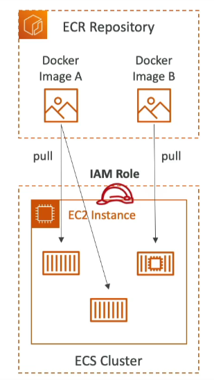

# Elastic Container Registry (ECR)

Amazon Elastic Container Registry (ECR) is a fully managed Docker container registry that allows developers to store, manage, and deploy Docker container images. It supports both private and public repositories, with the public repositories being accessible through the Amazon ECR Public Gallery.

## Key Features

- **Integration**: Fully integrated with Amazon ECS and backed by Amazon S3, providing a seamless workflow for deploying containerized applications.
- **Access Control**: Access to repositories is controlled through AWS Identity and Access Management (IAM), ensuring secure management of images. Permission errors can be resolved by adjusting IAM policies.
- **Security**: Supports vulnerability scanning of images to identify security issues before deployment.
- **Versioning and Tags**: Offers image versioning and tagging, enabling better management of image releases.
- **Image Lifecycle Management**: Allows for the configuration of image lifecycle policies to automatically clean up unused images, helping to manage storage costs effectively.

By leveraging ECR, developers can enhance their container management and deployment processes on AWS, benefiting from the robust security and scalability of AWS infrastructure.

