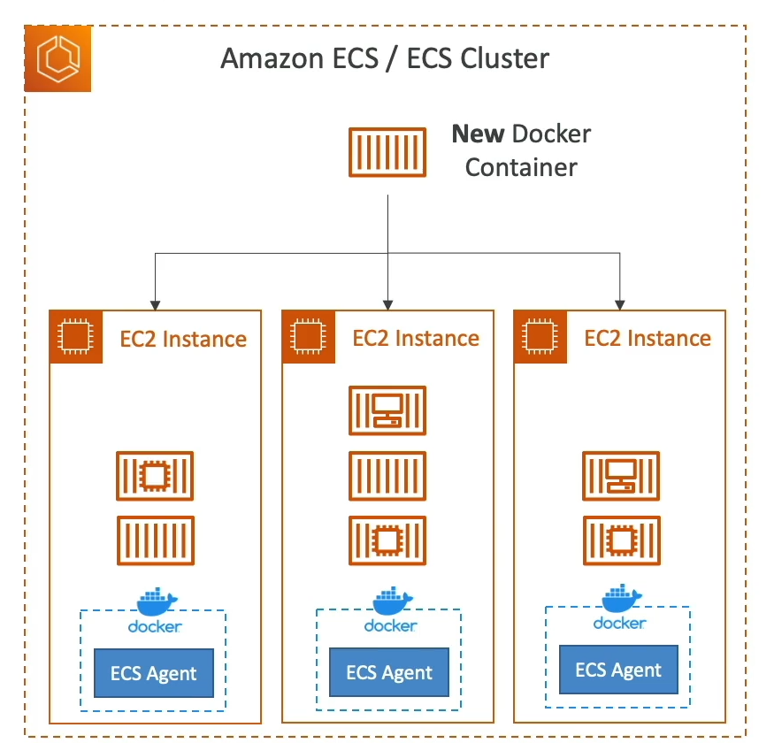

# ECS - EC2 Launch Type Overview

Amazon Elastic Container Service (ECS) allows for the orchestration of Docker containers on AWS. One of the launch types supported by ECS is the EC2 Launch Type.

## EC2 Launch Type

The EC2 Launch Type enables you to launch ECS tasks on Amazon EC2 instances. This approach provides you with control over the infrastructure that your containers run on.

### Key Points

- **Infrastructure Management**: Users must provision and maintain the EC2 instances that the tasks will run on. This includes selecting the appropriate instance type and size based on the workload.
- **ECS Agent**: Each EC2 instance must be running the ECS agent. The ECS agent is responsible for registering the instance with the ECS cluster, and it helps in managing the containers on the instance.
- **AWS Management**: While users are responsible for managing the EC2 instances, AWS takes care of the orchestration part, such as starting and stopping containers based on the task definitions.

### Advantages

- **Control**: Provides more control over the hosting environment, allowing for customizations such as instance type, size, and the underlying operating system.
- **Compatibility**: Ideal for workloads that require specific configurations or software that is not supported by other launch types.

### Considerations

- **Maintenance**: Requires ongoing maintenance and management of the EC2 instances, including patching and scaling.
- **Cost**: Users pay for the EC2 instances, so it's important to monitor and optimize resource utilization to manage costs effectively.

