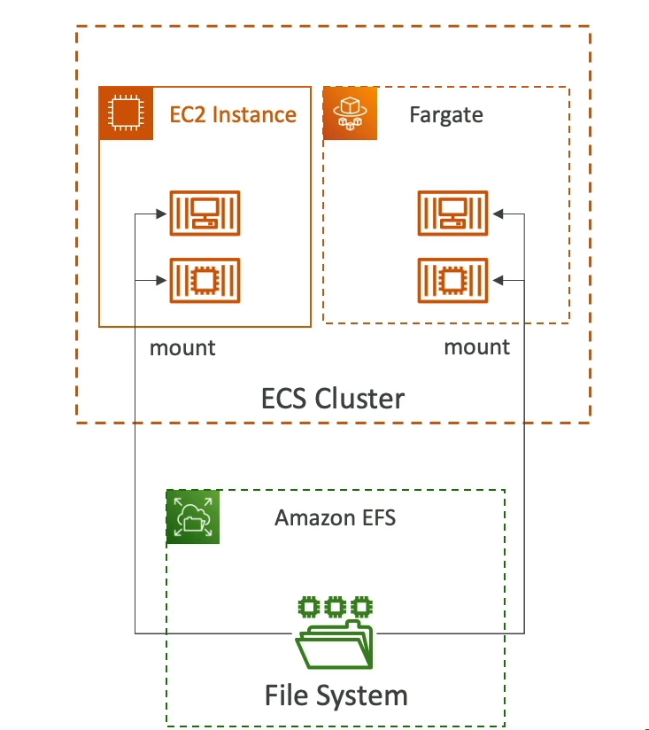

# Data Volumes with EFS on ECS

Amazon Elastic File System (EFS) provides a simple, scalable, elastic file storage for use with AWS Cloud services and on-premises resources. It can be mounted onto ECS tasks, supporting both EC2 and Fargate launch types, enabling tasks running in any Availability Zone (AZ) to share the same data.

## Mounting EFS on ECS Tasks

- **Compatibility**: Works with both EC2 and Fargate launch types.
- **Shared Data**: Tasks across different AZs can access and share the same data stored in the EFS file system.
- **Serverless**: Combining Fargate with EFS offers a serverless solution, removing the need to manage servers while providing persistent, multi-AZ shared storage.

## Use Cases

- **Persistent Storage**: Ideal for applications that require persistent storage accessible by multiple tasks across different AZs.
- **Shared Storage**: Serves as shared storage for containers, allowing data to be shared and accessed concurrently by multiple tasks.

## Note

- Unlike Amazon S3, which is an object storage service, EFS is designed to be mounted as a file system and cannot be directly mounted onto ECS tasks. Amazon S3 is great for storing and retrieving large amounts of data but does not function as a file system that ECS tasks can directly interact with.

