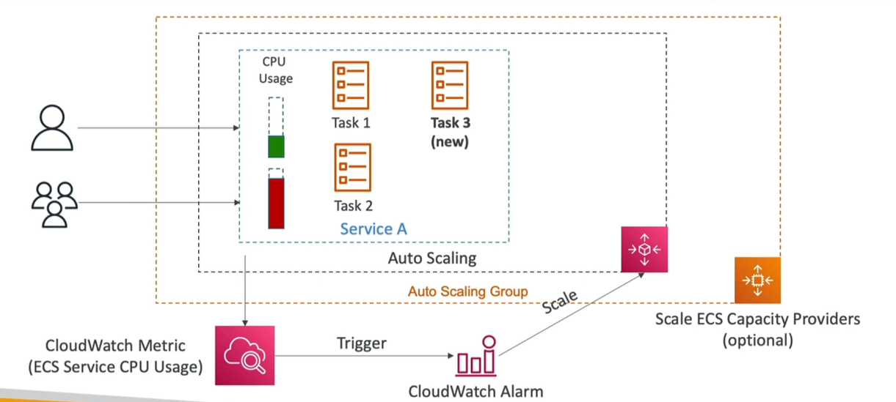

# EC2 Launch Type - Auto Scaling for ECS Services

Auto-scaling for ECS services using the EC2 Launch Type involves scaling the underlying EC2 instances to accommodate the scaling of ECS services. This ensures that there is always sufficient capacity to run your tasks.

## Auto Scaling Group (ASG) Scaling

The Auto Scaling Group (ASG) manages the scaling of EC2 instances based on predefined metrics such as CPU Utilization.

### Key Points

- **CPU Utilization**: Scale your ASG based on the CPU utilization of the EC2 instances. This ensures that additional instances are added when the CPU usage goes beyond a certain threshold.
- **Incremental Scaling**: Add EC2 instances over time to match the demand of your ECS services, ensuring that your applications maintain optimal performance and cost efficiency.

## ECS Cluster Capacity Provider

The ECS Cluster Capacity Provider automates the provisioning and scaling of the infrastructure required for your ECS tasks.

### Advantages

- **Automatic Provisioning**: Automatically adds EC2 instances to your cluster when there's a lack of capacity (CPU, RAM, etc.), ensuring that your ECS tasks always have the resources they need to run.
- **Seamless Integration**: Works seamlessly with ECS to manage the infrastructure scaling based on the needs of your services, making it easier to manage application scaling.

By leveraging both ASG scaling and ECS Cluster Capacity Providers, you can ensure that your ECS services running on EC2 instances are always backed by the necessary infrastructure, allowing for efficient scaling and management of your containerized applications.

