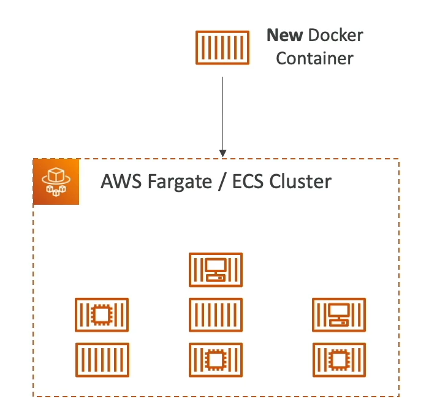

# ECS - Fargate Launch Type Overview

Amazon Elastic Container Service (ECS) supports the Fargate launch type, offering a serverless compute engine for containers. This approach allows you to run containers without managing servers or clusters.

## Fargate Launch Type

Fargate simplifies running containers on AWS by managing the infrastructure for you.

### Key Points

- **Serverless**: Eliminates the need to provision or manage EC2 instances. You focus solely on your application.
- **Task Definitions**: You define your applications in task definitions, which specify the Docker container images, CPU and memory requirements, and the networking and IAM policies.
- **AWS Management**: AWS automatically manages the scheduling and running of your containers based on the specifications in your task definitions.
- **Scaling**: Scaling is straightforward. Adjust the number of tasks based on your needs without worrying about the underlying infrastructure.

### Advantages

- **Simplicity**: Reduces the complexity of container management by abstracting the underlying server and cluster management.
- **Cost-Effectiveness**: You pay only for the resources your tasks use. There's no extra cost for the underlying servers.
- **Flexibility**: Easily integrates with other AWS services, providing a comprehensive solution for deploying and managing containerized applications.

### Considerations

- **Task Definitions**: Requires careful planning and configuration to ensure your applications have the resources they need.
- **Networking**: You must configure networking in a way that suits your application architecture, using AWS VPCs and security groups.

By leveraging the Fargate launch type, you can focus more on developing your applications and less on managing the infrastructure.

