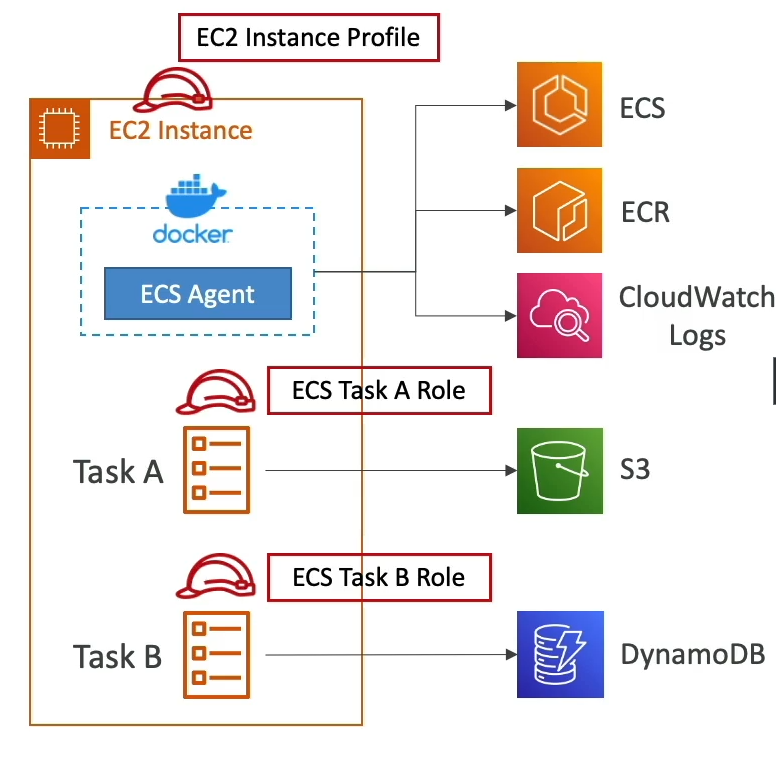

# IAM Roles for ECS

AWS Identity and Access Management (IAM) roles play a crucial role in securing and enabling AWS services to interact with other AWS services. In the context of Amazon Elastic Container Service (ECS), there are two primary types of IAM roles: EC2 Instance Profile and ECS Task Role.

## EC2 Instance Profile (EC2 Launch Type Only)

This role is specifically used when ECS is configured to use the EC2 Launch Type. It is attached to the EC2 instances that run the ECS agent, allowing the agent to interact with AWS services on behalf of the user.

### Key Permissions

- **ECS Agent**: Enables the ECS agent to make API calls to the ECS services.
- **CloudWatch Logs**: Allows the instance to send container logs to Amazon CloudWatch Logs for monitoring and troubleshooting.
- **ECR**: Grants permission to pull Docker images from Amazon Elastic Container Registry (ECR).
- **Secrets Manager and SSM Parameter Store**: Provides access to sensitive data stored in AWS Secrets Manager or the AWS Systems Manager Parameter Store, which can be used for secure application configuration.

## ECS Task Role

Unlike the EC2 Instance Profile, the ECS Task Role is assigned directly to the ECS tasks, allowing each task to have a specific role. This is particularly useful when running multiple services within ECS that require different permissions.

### Key Benefits

- **Service-Specific Permissions**: Enables fine-grained control over AWS service permissions for each ECS task, ensuring that tasks have only the permissions they need to operate.
- **Task Definition**: The task role is defined within the ECS task definition, making it easy to manage and version control alongside your application code.

### Use Cases

- **Different ECS Services**: Ideal for scenarios where different ECS services need to interact with different AWS resources, allowing for secure and least privilege access.
- **Secure Access**: Ensures that tasks can securely access other AWS services they need to function, such as accessing a database password stored in Secrets Manager or reading a configuration file from an S3 bucket.

By effectively utilizing IAM roles, you can enhance the security and efficiency of your ECS deployments, whether using EC2 Launch Type or Fargate.

