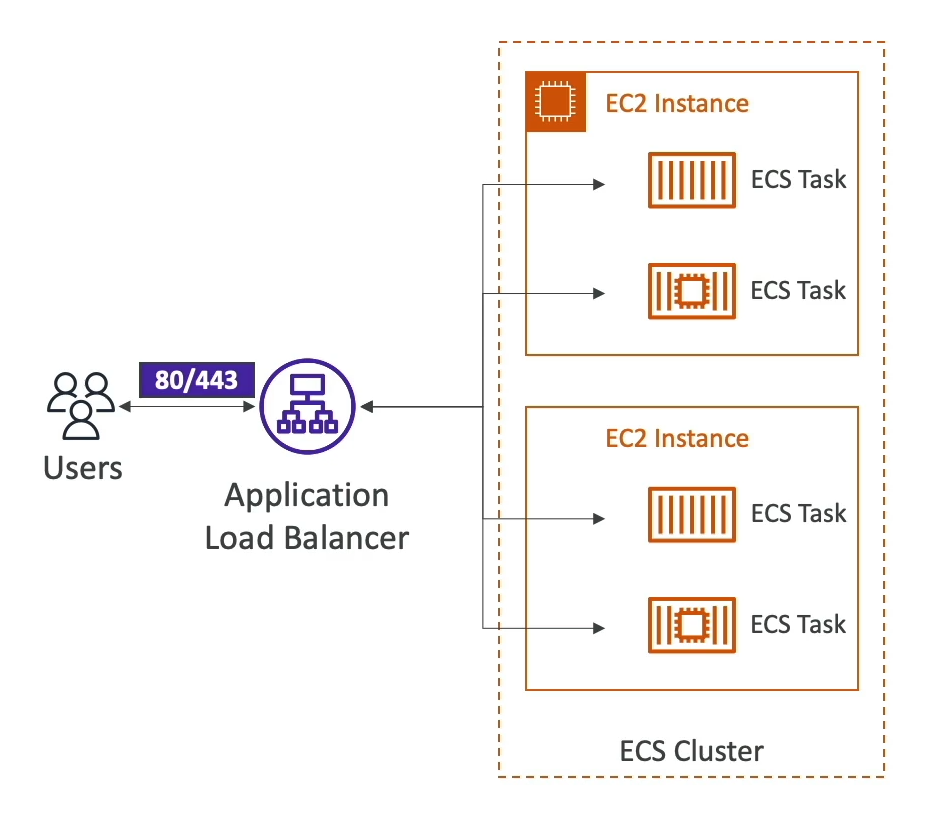

# ECS - Load Balancer Integrations

Integrating load balancers with Amazon Elastic Container Service (ECS) enhances the distribution of traffic across your containerized applications. Here's how ECS works with different types of AWS load balancers.

## Application Load Balancer (ALB)

- **Supported**: Yes, for most use cases.
- **Key Features**:
    - Advanced request routing, ideal for microservices and containerized applications.
    - Supports dynamic host port mapping, allowing multiple tasks from the same service to be hosted on a single EC2 instance.
    - Direct integration with ECS, simplifying service discovery.

## Network Load Balancer (NLB)

- **Recommended For**: High throughput and high-performance use cases, or when pairing with AWS Private Link.
- **Key Features**:
    - Operates at the fourth layer of the OSI model (Transport layer), handling millions of requests per second with low latencies.
    - Suitable for TCP traffic where extreme performance is required.
    - Can be used to securely expose your ECS services to the internet.

## Classic Load Balancer (CLB)

- **Supported**: Yes, but not recommended.
- **Key Features**:
    - Provides basic load balancing across multiple EC2 instances.
    - Lacks advanced routing and targeting features available in ALB and NLB.
    - Does not support Fargate or modern application architectures effectively.

