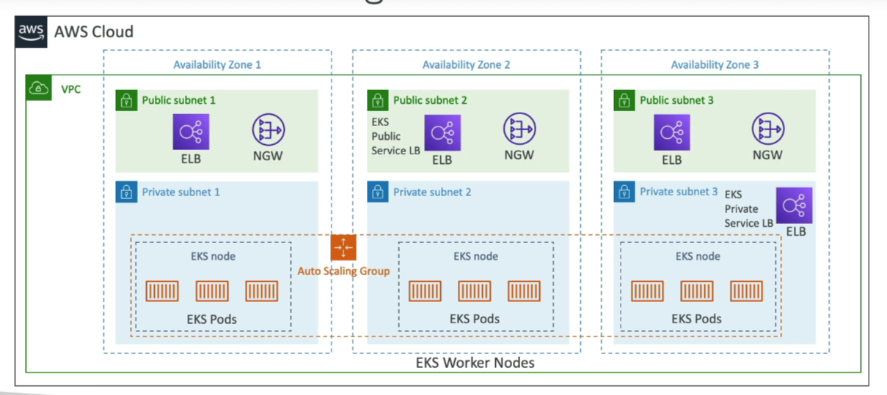

# Amazon Elastic Kubernetes Service (EKS)

Amazon Elastic Kubernetes Service (EKS) is a managed service that makes it easier for you to run Kubernetes on AWS without needing to install and operate your own Kubernetes clusters.

## Overview

- **Kubernetes (K8S)**: An open-source system for automating the deployment, scaling, and management of containerized applications.
- **Managed Kubernetes**: EKS provides a managed Kubernetes service that takes care of the underlying infrastructure for you.
- **Containerization**: Primarily supports Docker containers.

## Key Features

- **EC2 and Fargate Support**: EKS allows you to deploy worker nodes using EC2 instances or run serverless containers with AWS Fargate.
- **Cloud-Agnostic**: Kubernetes is cloud-agnostic, meaning it can be used across different cloud providers such as Azure and Google Cloud Platform (GCP).
- **Use Case**: Ideal for companies looking to migrate their existing Kubernetes workloads to AWS or those already using K8S on-premises or with another cloud provider.

## Why EKS?

EKS provides a seamless integration path for existing Kubernetes workloads, leveraging AWS's scalability and security. It's an excellent choice for organizations seeking to maintain their investment in Kubernetes while also taking advantage of the AWS ecosystem.

