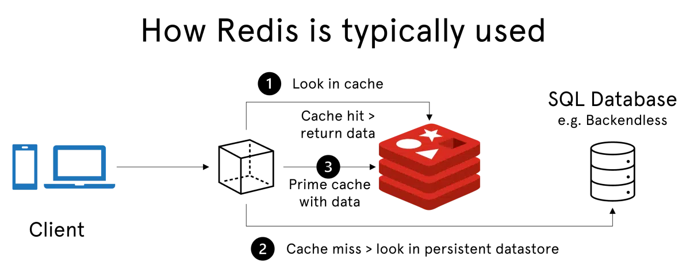

# ElastiCache - Cache Security

## IAM Policies on ElasticCache
- IAM policies on ElasticCache are only used for AWS API-level security.

## Redis AUTH
- You can set a "password/token" when you create a Redis cluster.
- This is an extra level of security for your cache (on top of security groups).
- Supports SSL in-flight encryption.

## Memcached
- Supports SASL-based authentication (advanced).

# Redis Use Case

## Gaming Leaderboards
- Gaming Leaderboards are computationally complex.
- Redis sorted sets guarantee both uniqueness and element ordering.
- Each time a new element is added, it's ranked in real time, then added in the correct order.

