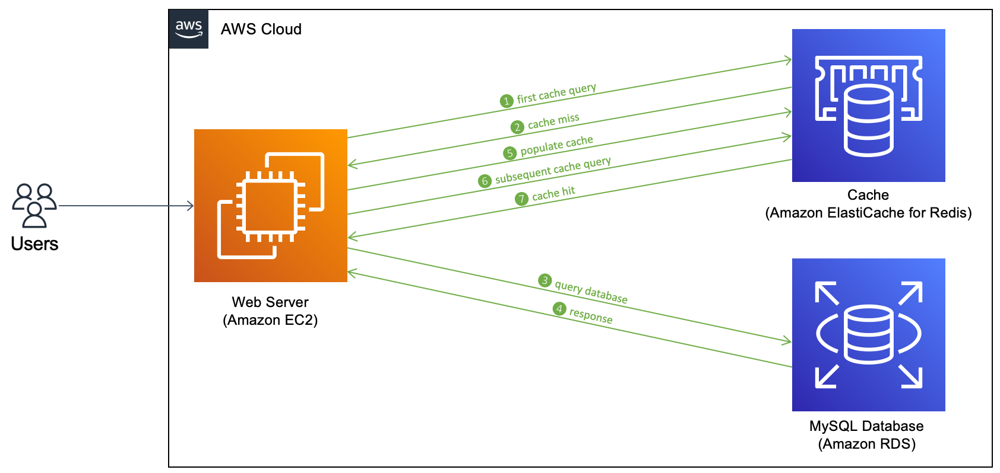

# ElastiCache Overview

ElastiCache is AWS's managed caching service, similar to how RDS provides managed relational database services. It supports two popular in-memory caching systems: Redis and Memcached. These systems offer high performance and low latency, making them ideal for reducing the load on databases, especially for read-intensive workloads. By caching frequently accessed data, ElastiCache helps make applications more scalable and stateless.

## Key Features

- **Managed Service**: AWS handles the maintenance, including OS patching, optimizations, setup, and configuration.
- **Performance**: Provides high performance and low latency by keeping data in memory.
- **Scalability**: Easily scale your cache size and performance to meet demand.
- **Monitoring and Metrics**: Integrated with Amazon CloudWatch for monitoring and metrics.
- **Failure Recovery**: Automatic failure detection and recovery mechanisms.
- **Backups and Snapshots**: Supports backups and snapshots for Redis clusters, ensuring data durability.

ElastiCache is an effective solution for applications that require fast data retrieval and aim to minimize database load, thereby enhancing overall application performance.

