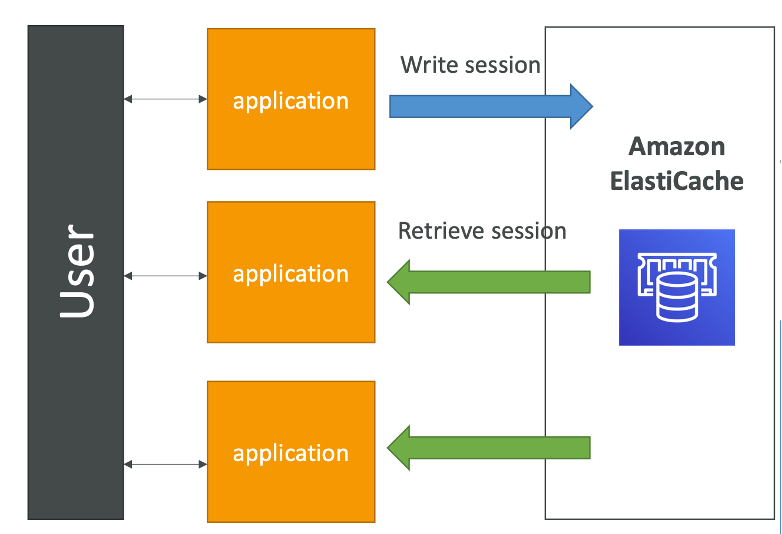

# User Session Store with ElastiCache

To implement a user session store using ElastiCache, follow these steps:

## Prerequisites
- An AWS account with ElastiCache configured (either Redis or Memcached).
- Application instances configured to communicate with the ElastiCache cluster.

## Implementation Steps

1. **User Login**:
   - When a user logs into the application, authenticate the user's credentials.
   - Upon successful authentication, generate a unique session ID for the session.

2. **Write Session Data to ElastiCache**:
   - Store the session data in ElastiCache using the session ID as the key.
   - The session data can include user-specific information like user ID, roles, and preferences.

3. **Set Expiry for Session Data**:
   - Optionally, set an expiry time for the session data to automatically invalidate stale sessions.

4. **Retrieve Session on Subsequent Requests**:
   - For each request from the user, retrieve the session ID from the user's cookie or token.
   - Use the session ID to fetch the session data from ElastiCache.
   - If the session data exists, consider the user as logged in and proceed with the request.
   - If the session data does not exist (e.g., expired or logged out), redirect the user to the login page.

5. **Update Session Data as Needed**:
   - If the user's session data changes during the session, update the corresponding entry in ElastiCache.

6. **User Logout**:
   - Upon user logout, delete the session data from ElastiCache to invalidate the session immediately.

## Benefits
- **Scalability**: Easily scales with your application's user base and traffic.
- **Performance**: Reduces database load by caching session data in memory for fast retrieval.
- **Statelessness**: Enables your application instances to be stateless, simplifying scaling and deployment.

