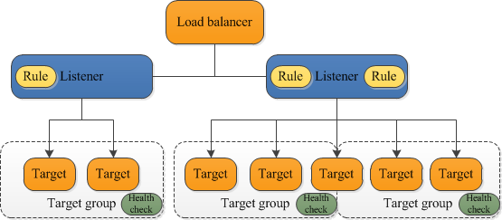

# Application Load Balancer (v2)

Application Load Balancer (ALB) operates at Layer 7 of the OSI model (HTTP/HTTPS layer) and offers more advanced routing capabilities compared to the Classic Load Balancer.

## Features

- **Load Balancing Across Multiple Applications**: ALB can balance loads to multiple HTTP applications across machines (target groups) or multiple applications on the same machine (e.g., containers).
- **Support for HTTP/2 and WebSocket**: ALB supports the HTTP/2 and WebSocket protocols for improved performance.
- **Support for Redirects**: ALB supports redirects, such as from HTTP to HTTPS.
- **Advanced Routing**: ALB can route requests based on the content of the request. This includes routing based on the path in the URL (e.g., example.com/users, example.com/posts), the hostname in the URL (e.g., one.example.com, other.example.com), or the query string and headers in the request (e.g., example.com/users?id=123&order=false).

## Target Groups

ALB routes requests to one or more registered targets, such as EC2 instances, within one or more target groups. A target group routes requests to one or more registered targets, such as EC2 instances, when it receives traffic from the load balancer. You can associate zero or more security groups with a target group.

- **EC2 Instances**: These can be managed by an Auto Scaling Group. The protocol for the targets is HTTP.
- **ECS Tasks**: These are managed by ECS itself. The protocol for the targets is HTTP.
- **Lambda Functions**: The HTTP request is translated into a JSON event.
- **IP Addresses**: These must be private IPs.

## Good to Know

- **Fixed Hostname**: ALB provides a fixed hostname (XXX.region.elb.amazonaws.com).
- **Client IP Address Preservation**: The application servers don't see the IP of the client directly. The true IP of the client is inserted in the header X-Forwarded-For. We can also get the Port (X-Forwarded-Port) and the protocol (X-Forwarded-Proto).

