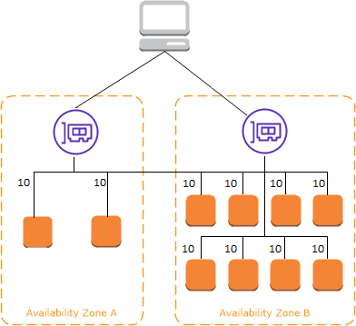
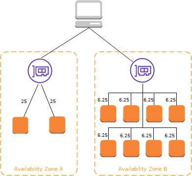

# Cross-Zone Load Balancing

Cross-Zone Load Balancing allows each load balancer instance to distribute traffic evenly across all registered instances in all Availability Zones (AZs). Without Cross-Zone Load Balancing, requests are distributed only among the instances of the node of the Elastic Load Balancer.

## Application Load Balancer

- Cross-Zone Load Balancing is enabled by default. However, it can be disabled at the target group level.
- There are no charges for inter-AZ data transfer.

## Network Load Balancer & Gateway Load Balancer

- Cross-Zone Load Balancing is disabled by default.
- If enabled, you will incur charges for inter-AZ data transfer.

### With Cross-Zone Load Balancing

### Without Cross-Zone Load Balancing
