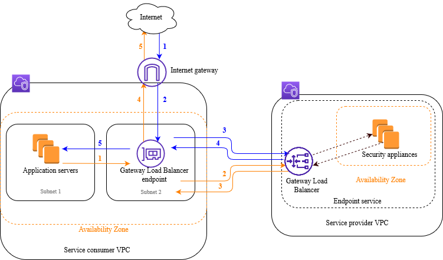

# Gateway Load Balancer

- Gateway Load Balancer allows you to deploy, scale, and manage a fleet of 3rd party network virtual appliances in AWS. Examples include Firewalls, Intrusion Detection and Prevention Systems, Deep Packet Inspection Systems, payload manipulation, etc.

- It operates at Layer 3 (Network layer) and deals with IP packets.

- It combines the following functions:
    - Transparent network gateway: It acts as a single entry/exit point for all traffic.
    - Load Balancer: It distributes traffic to your virtual appliances.

- Gateway Load Balancer uses the GENEVE protocol on port 6081.

