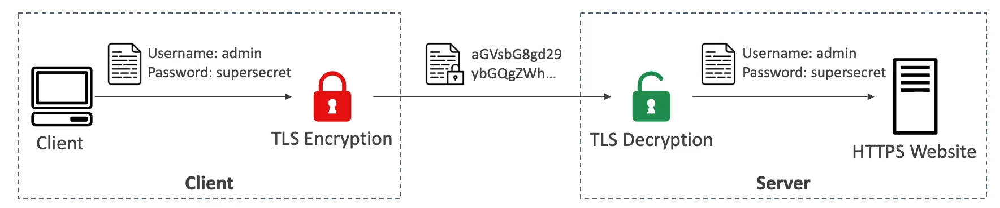
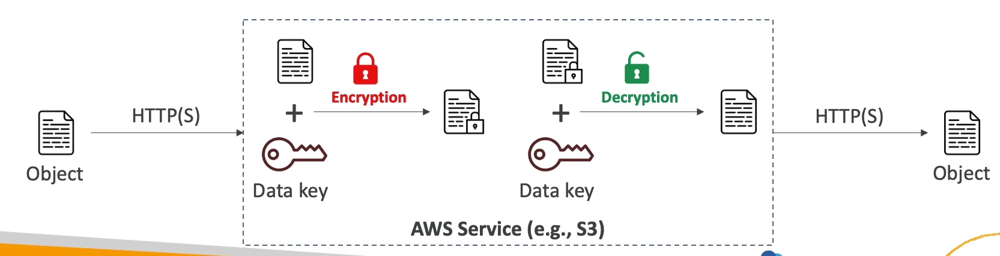
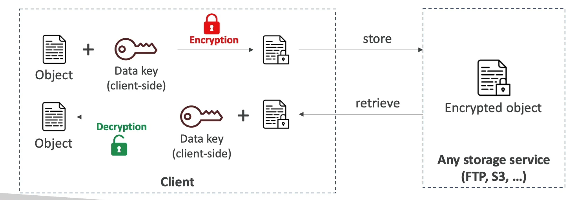

# Encryption Overview

## Encryption in Flight (TLS/SSL)

- **Process**: Data is encrypted before sending and decrypted after receiving.
- **TLS Certificates**: Help with encryption (HTTPS).
- **Security**: Ensures no MITM (Man-In-The-Middle) attack can happen.

## Server-side Encryption at Rest

- **Process**: Data is encrypted after being received by the server and decrypted before being sent.
- **Storage**: Data is stored in an encrypted form using a key (usually a data key).
- **Key Management**: The encryption/decryption keys must be managed somewhere, and the server must have access to them.

## Client-side Encryption

- **Process**: Data is encrypted by the client and never decrypted by the server.
- **Decryption**: Data will be decrypted by a receiving client.
- **Security**: The server should not be able to decrypt the data.
- **Technique**: Could leverage Envelope Encryption.

