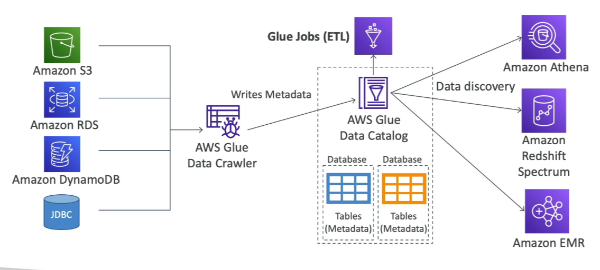

# Glue

Amazon Glue is a managed extract, transform, and load (ETL) service that is useful for preparing and transforming data for analytics. It is a fully serverless service, making it easy to run ETL jobs without managing infrastructure.

## Key Features

- **Serverless**: No infrastructure to manage, fully managed by AWS.
- **Glue Job Bookmarks**: tracks data that has already been processed during a previous run of an ETL job by persisting state information from the job run
- **Glue Elastic Views**:
    - Combine and replicate data across multiple data stores using SQL.
    - No custom code required; Glue monitors for changes in the source data.
    - Leverages a virtual table (materialized view).
- **Glue DataBrew**: Clean and normalize data using pre-built transformations.
- **Glue Studio**: A new GUI to create, run, and monitor ETL jobs in Glue.
- **Glue Streaming ETL**:
    - Built on Apache Spark Structured Streaming.
    - Compatible with Kinesis Data Streams, Kafka, and Amazon MSK (Managed Streaming for Kafka).

By leveraging these features, Amazon Glue simplifies the process of preparing and transforming data for analytics, enabling efficient and scalable data workflows.

