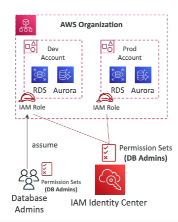

# IAM Identity Center Fine-grained Permissions and Assignments

## Multi-account Permissions

- **Manage Access**: Manage access across AWS accounts in your AWS Organization.
- **Permission Sets**: A collection of one or more IAM Policies assigned to users and groups to define AWS access.

## Application Assignments

- **SSO Access**: Single Sign-On access to many SAML 2.0 business applications (e.g., Salesforce, Box, Microsoft 365).
- **Requirements**: Provide required URLs, certificates, and metadata.

## Attribute-based Access Control (ABAC)

- **Fine-grained Permissions**: Based on user's attributes stored in IAM Identity Center Identity Store.
    - Example attributes: cost center, title, locale.
- **Use Cases**: Define permissions once, then modify AWS access by changing attributes.

