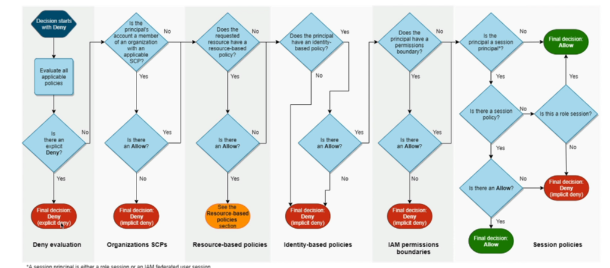

# IAM Permission Boundaries

## Overview

- **Supported for**: Users and roles (not groups).
- **Advanced feature**: Use a managed policy to set the maximum permissions an IAM entity can get.
- **Combination**: Can be used in combination with AWS Organizations SCP.

## Use Cases

- **Delegate responsibilities**: Allow non-administrators to perform tasks within their permission boundaries, e.g., create new IAM users.
- **Self-assign policies**: Enable developers to manage their own permissions without escalating privileges (e.g., making themselves admin).
- **Specific user restriction**: Restrict permissions for a specific user instead of an entire account using Organizations & SCP.

