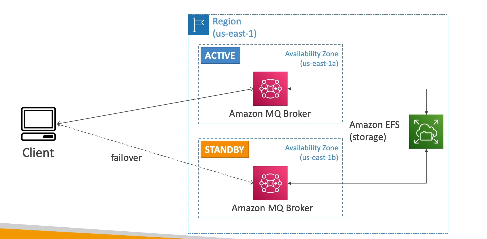

# Amazon MQ Overview

Amazon MQ is a managed message broker service that facilitates the migration of traditional applications to the cloud without the need to re-engineer the application's messaging services. It supports open messaging protocols, making it an ideal choice for applications originally designed for on-premises deployment.

## Key Features

### Support for Open Protocols

- **Protocols**: Amazon MQ is compatible with a variety of open messaging protocols, including MQTT, AMQP, STOMP, OpenWire, and WSS. This compatibility allows for easy migration of applications that use these protocols.

### Managed Service

- **RabbitMQ and ActiveMQ**: Amazon MQ supports both RabbitMQ and ActiveMQ, offering flexibility in choosing the message broker that best fits your application's needs.

### Scalability

- **Comparison with SQS/SNS**: While Amazon MQ provides essential messaging features, it does not scale as extensively as AWS's cloud-native services like SQS and SNS.

### Deployment and Availability

- **Multi-AZ Deployment**: Amazon MQ can be run on servers across multiple Availability Zones (AZs), ensuring high availability and failover capabilities.

### Messaging Features

- **Queue and Topic Features**: Amazon MQ offers features similar to both SQS (queues) and SNS (topics), providing both point-to-point and publish/subscribe messaging patterns.

By leveraging Amazon MQ, businesses can migrate their traditional applications to the cloud more seamlessly, without the need to significantly alter their existing messaging infrastructure.

